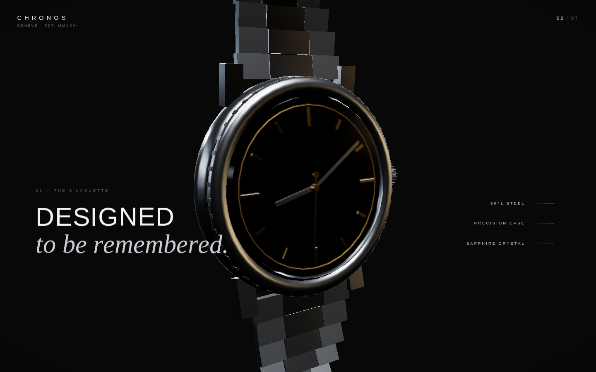
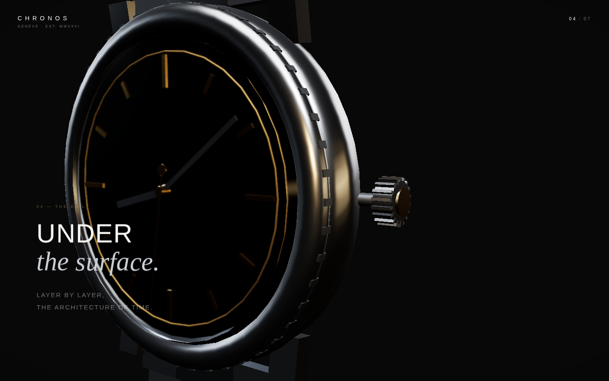
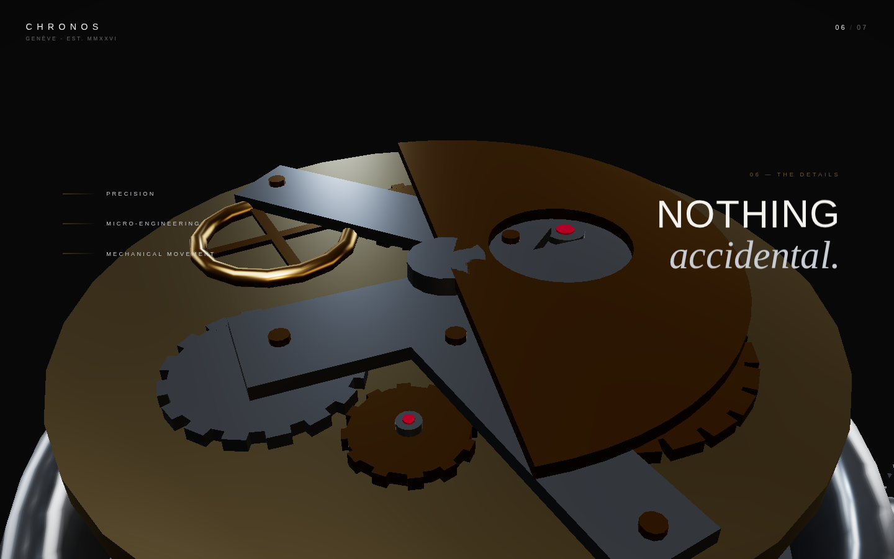

# CHRONOS — Time, unfolded.

**An immersive, scroll-driven 3D experience that disassembles and reassembles a luxury mechanical watch in real time.**

Built with Three.js, GSAP ScrollTrigger and Anime.js — no application framework. The page scroll acts as a cinematic timeline: as you scroll, the camera travels around the watch, the case opens, the calibre is exposed gear by gear, and the piece rebuilds itself for the closing shot.

```
SCROLL → CAMERA → WATCH → MECHANISM → REASSEMBLY
```

| The silhouette | The dial opens | The movement |
| --- | --- | --- |
|  |  |  |

## Tech stack

**Runtime** — Three.js (WebGL rendering, PBR materials, PMREM environment), GSAP + ScrollTrigger (scrubbed master timeline), Anime.js (typographic reveals, loading sequence).

**Tooling** — webpack 5 (dev server with HMR, code splitting, content hashing), Babel (browserslist-driven transpiling), Sass + PostCSS/Autoprefixer, Nunjucks as the HTML template engine (layout, partials and macros rendered at build time from a content data module).

## Getting started

```bash
npm install
npm run dev       # dev server with HMR on http://localhost:8080
```

| Script | What it does |
| --- | --- |
| `npm run dev` | Development server with hot module replacement |
| `npm run build` | Production build to `dist/` (minified, hashed, source maps) |
| `npm run preview` | Builds and serves `dist/` on http://localhost:4173 |
| `npm run clean` | Removes `dist/` |
| `npm run format` | Prettier over `src/` |

Requires Node 20+ (see `.nvmrc`).

## Architecture

The codebase is organised in layers with a strict dependency direction — UI and animation never reach into geometry, and nothing but one module ever touches the scene graph from scroll events:

```
src/
├── data/site.js            # all page copy, consumed by the templates
├── templates/              # Nunjucks: layout → index → partials/macros
├── styles/                 # SCSS layers; _tokens.scss is the design system
├── assets/models/          # ← drop watch.glb here (see below)
└── js/
    ├── main.js             # entry point
    ├── config/             # settings.js (every constant) · capabilities.js (device detection)
    ├── core/               # app.js (bootstrap) · context.js (scene refs) · state.js (animation state)
    ├── scene/              # scene · camera · renderer · lights · environment · viewport
    ├── watch/              # materials · factories · procedural model · GLB loader
    ├── animation/          # choreography (data) · timeline · apply-state · loop
    └── ui/                 # headline · sections · loading-screen · cursor
```

### The core idea: state-driven choreography

The scroll timeline never touches the scene graph. It tweens a single plain
object — `animationState` in `core/state.js` — holding the camera rig, the
watch orientation, per-part explode offsets, gear speed and light intensities.
Every frame, `animation/apply-state.js` maps that state onto whichever model
is loaded.

The whole cinematic score lives in `animation/choreography.js` as a flat,
declarative list of beats (one unit = one section):

```js
{ at: 4.3, duration: 0.65, ease: "power1.inOut", to: { crystalY: 2.75 } },
```

This buys three things: the procedural mock and a production GLB are perfectly
interchangeable; the choreography is reviewable at a glance and tweakable
without touching any rendering code; and there is exactly one writer for every
animated property.

### Scroll map

| Progress | Section | Beat |
| --- | --- | --- |
| 0–15% | 01 Introduction | the watch emerges, camera closes in |
| 15–30% | 02 The Silhouette | slow orbit, bezel highlight, technical labels |
| 30–45% | 03 The Crown | side close-up, the crown slides out |
| 45–60% | 04 The Dial | crystal, bezel and dial begin to lift |
| 60–75% | 05 The Movement | full vertical explosion, top-down view, gears alive |
| 75–90% | 06 The Details | extreme macro drift over the calibre |
| 90–100% | 07 The Complete Piece | staggered reassembly, wide hero shot, CTA |

Gears, rotor and balance wheel keep animating while the scroll is at rest —
but every part's *position* is always owned by the scroll.

## Using a production GLB model

Drop your model at `src/assets/models/watch.glb`. It is detected at startup
and replaces the procedural mock — no code changes. The loader
(`js/watch/loader.js`) expects this node-name contract:

```
Watch
├── Case · Bezel · Crystal · Crown · Dial
├── HourHand · MinuteHand · SecondsHand
├── Movement
│   ├── MainPlate · Gear01…Gear05 (up to Gear08) · Rotor
│   ├── Bridge01…Bridge03 · BalanceWheel
└── Bracelet
```

Authoring guidelines: build it dial-up (dial normal = +Y), centred at the
origin, case radius ≈ 1.7 scene units; give each part above its own named
node with the pivot at its centre of rotation; keep it under ~150k triangles
with 2k PBR textures (Draco/meshopt welcome — add the decoder in the loader).
Missing nodes are warned in the console and skipped gracefully.

## Performance

Pixel ratio is capped at 2 (1.5 on low-performance devices); tessellation,
bracelet links and bezel fluting are reduced on constrained hardware;
antialiasing and soft shadows are desktop-only. The bloom is a CSS radial
gradient — zero GPU cost. `prefers-reduced-motion` disables the idle spin,
ticking and parallax; the scrubbed timeline remains, since it only moves when
the user does. Three.js ships as its own cacheable chunk via code splitting.

## License

[MIT](LICENSE) © Gabriel Escabora
